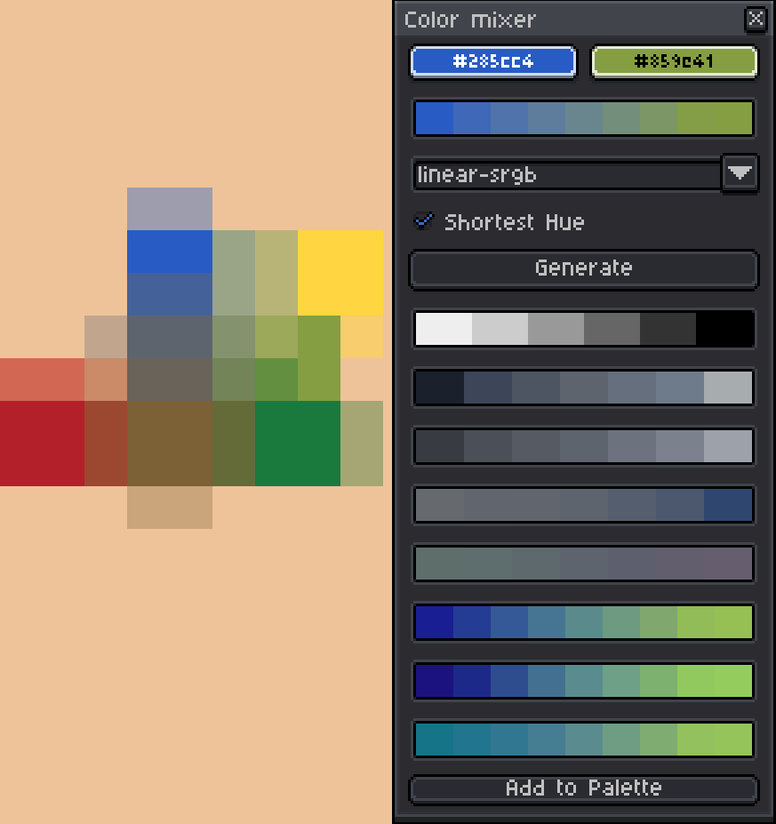

# Dipflix Color Mixer (Aseprite Extension)

Mix two colors with multiple color spaces, pick from preset ramps, and generate quick palette lines.

## Features
- Two input colors (left/right) with a mix ramp.
- Mix spaces: `linear-srgb`, `sr-lab-2`, `lch`, `oklab`, `oklch`.
- Shortest-hue toggle for hue-based spaces.
- Anime mix rows: soft / punchy / cool.
- Generated palette rows: gray, shade, lightness, saturation, hue.
- Add current mixed color to sprite palette.

## Shortcuts
- `Alt+Z` — pick left color from cursor (or fg color).
- `Alt+X` — pick right color from cursor (or fg color).

## Usage
1. Open **Help → Dipflix → Color Mixer**.
2. Set left/right colors.
3. Choose a mix space and click a swatch in the mix row.
4. Use **Generate** to build palette rows from the current fg color.
5. Click any generated swatch to set fg color.
6. Use **Add to Palette** to append the current mix result.
